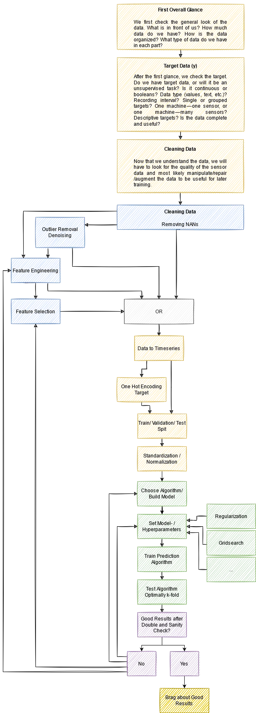

# This section is dedicated to the research of implementing Neural Networks in the field of stations.

Here we can find all the [code](https://github.com/JanderHungrige/PumpSensor).\
Here we can find the [data-set](https://ga-data-cases.s3.eu-central-1.amazonaws.com/pump_sensor.zip).


## Sugestion : use anaconda to create a Python 3.6 enviorment.

1. To create the enviorment use the following command:

```bash
conda create -n stations python=3.6
```

2. To activate the enviorment use the following command:

```bash
conda activate stations
```

3. To install the required packages in your anaconda enviorment use the following command:

```bash
pip install -r requirements.txt
```
(which pip -> shows which pip is used)\
(to put pip list in requirements.txt use the following command: pip freeze > requirements.txt)


## Introduction

An image to visualize the steps :  

We want to achieve predictive maintenance for pump **sensor data**.\
This approach is quite generic towards time-series analysis.\
**Time-series** analysis means that we have a sequence of data points indexed in time order.

## Data continued in [app.ipynb](./app.ipynb)