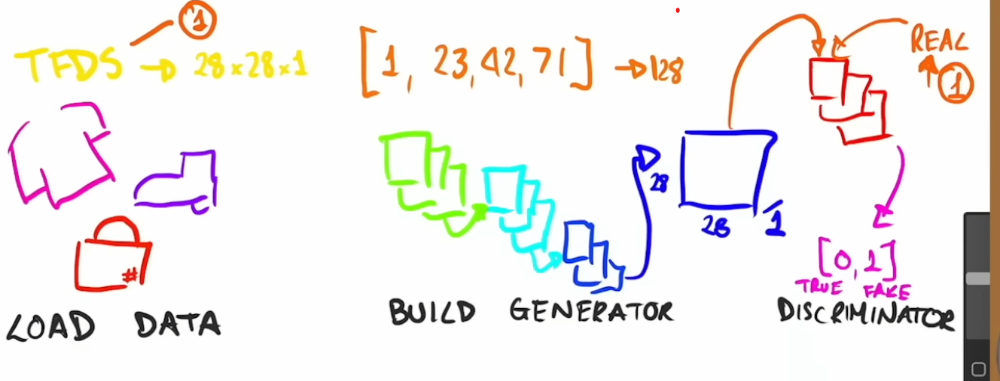

# Generative Adversarial Networks (GANs)

*TFDS* - tensorflow_datasets API
*Latent Dimension* - a bunch of random numbers that are used to generate images
    the numbers are used to output a set of values that represent the image
    ex : if we have a 28x28x1 image, we would need 784 numbers to represent it
*Generator* - is composed of a number of Convolution Network Layers, Lamp Sampling Layers.
    has the goal to fool the discriminator into thinking the image is real
*Discriminator* - is composed of a number of Convolution Network Layers and a final
    output of 0 or 1 which says if the image is real or fake

## We have to equally distribute the number of real and fake images to the discriminator
## if we don't, the discriminator will be too good and the generator will never learn

